<a name="Title"></a>
# Using Azure SQL Database in an ASP.NET Core website #

<a name="Overview"></a>
## Overview ##

Visual Studio for Mac enables you to quickly build modern websites using key technologies, such as ASP.NET Core and Azure SQL Database.

In this lab you will create and publish an ASP.NET Core website to Azure.

<a name="Objectives"></a>
## Objectives ##

- Creating an Azure SQL Database
- Connecting an ASP.NET Core website to the remote database
- Testing the website locally

<a name="Prerequisites"></a>
## Prerequisites ##

- [Visual Studio for Mac](https://www.visualstudio.com/vs/visual-studio-mac)
- [Microsoft Azure account](https://azure.microsoft.com/free?ref=VisualStudio)
  - Check out the **[Publishing ASP.NET Core websites to Azure with Visual Studio for Mac lab](../Publish-Azure)** for a step-by-step on how to create a free Azure trial account.

<a name="Intended Audience"></a>
## Intended Audience ##

This lab is intended for developers who are familiar with C#, although deep experience is not required.

<a name="Exercise1"></a>
## Exercise 1: Using Azure SQL Database in an ASP.NET Core website ##

<a name="Ex1Task1"></a>
### Task 1: Creating an Azure SQL Database ###

1. Open a new instance of **Safari** and log in to your Azure account at [https://portal.azure.com](https://portal.azure.com/).

1. Click **New** and search for **"sql"**.

    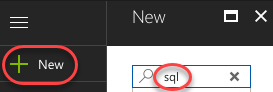

1. Click **SQL Database**.

    

1. Click **Create** at the bottom of the blade.

    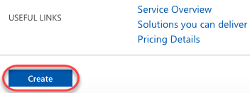

1. Enter **"azuresql"** as both the **Database name** and the name of a new **Resource group**.

    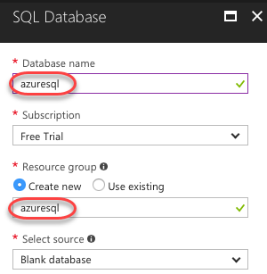

1. Click **Configure required settings** to configure a new Azure SQL server. You will need to provide a globally unique name, so start with **"azuresql-"** and append something unique, such as your name (**"azuresql-johndoe"** is used in this example). You will also need to provide admin credentials. In this example we're using **sysadmin** and **P2ssw0rd**. Finally, select a **Location** and click **Select**.

    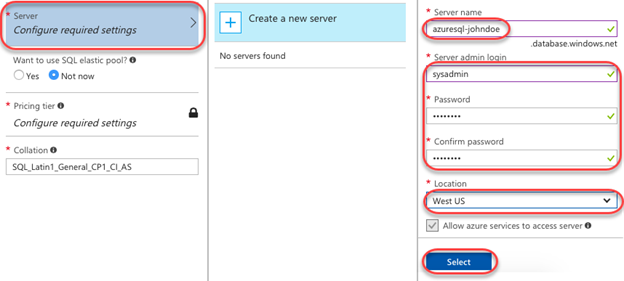

1. On the original blade, select a **Pricing tier** and click **Create.**

    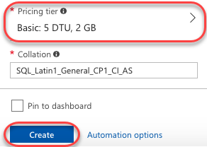

1. It will take a moment for the database to be created, but you don't need to wait for it now. Leave the browser open to the portal and move on to the next task.

<a name="Ex1Task2"></a>
### Task 2: Setting up the ASP.NET Core app ###

1. Open a new tab in **Safari** and navigate to [https://github.com/azure-samples/dotnetcore-sqldb-tutorial](https://github.com/azure-samples/dotnetcore-sqldb-tutorial). This sample is an ASP.NET Core website that uses Azure SQL to provide basic TODO functionality.

1. Expand **Clone or download** and click the **Copy to clipboard** button. This will copy the clone URL.

    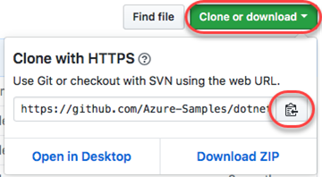

1. Open **Visual Studio for Mac**.

1. From the menu, select **Version Control | Checkout**.

1. Paste the **URL** and click **Checkout**.

    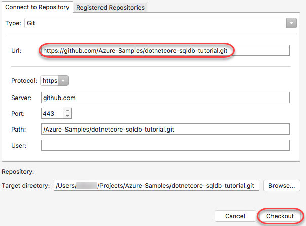

1. Once the project has downloaded, click **Open** to open it.

    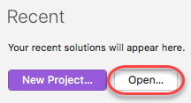

1. By default, the project will download to your **Projects** folder. Select **DotNetCodeSqlDb.csproj** and click **Open** to open the solution. This lab uses a preexisting solution to save time, but you can learn more about ASP.NET Core basics in the **[Getting started building ASP.NET Core applications in Visual Studio for Mac lab](../Getting-Started)**.

    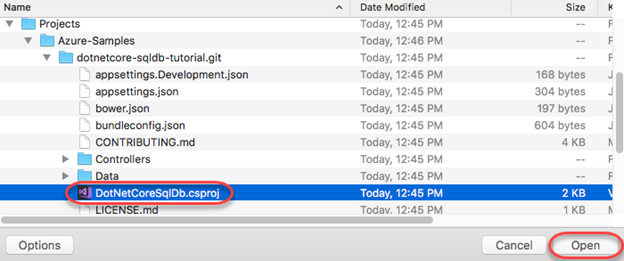

1. In the **Solution** pad, right-click the project node and select **Tools | Edit File**. This will open the file in the text editor.

    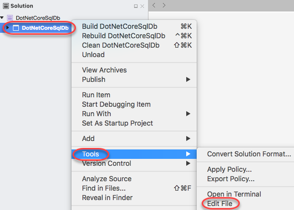

1. Update the **TargetFramework** to **netcoreapp2.0** and remove the **PackageTargetFallback** node and save the file.

    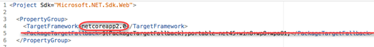

1. In the **Solution** pad, right-click the solution node and select **Update NuGet Packages**. Accept any licenses that are presented.

    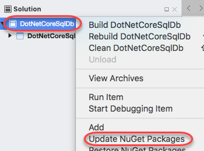

1. Open **Startup.cs** from the root of the project. Replace everything in the **ConfigureServices()** method after the **services.AddMvc()** call with the code below.

    ```c#
    // Use Azure SQL and a connection string from the configuration.
    services.AddDbContext<DotNetCoreSqlDb.Models.MyDatabaseContext>(
        options =>
            options.UseSqlServer(Configuration.GetConnectionString("MyDbConnection")));
    
    // Automatically update the database.
    services.BuildServiceProvider()
        .GetService<DotNetCoreSqlDb.Models.MyDatabaseContext>().Database.Migrate();
    ```
    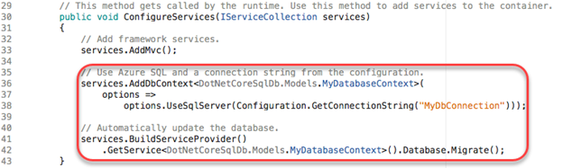

1. Open **Migrations/20170901142627_Initial.cs**. Replace the line defining the **ID** column with the one below.

    ```c#
    ID = table.Column<int>(nullable: false)
        .Annotation("SqlServer:ValueGenerationStrategy",
            Microsoft.EntityFrameworkCore.Metadata.SqlServerValueGenerationStrategy
                .IdentityColumn),
    ```
    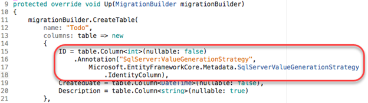

<a name="Ex1Task3"></a>
### Task 3: Configuring the SQL Azure Database ###

1. Return to the browser tab open to the Azure portal.

1. Click **All resources** from the navigation menu and click your SQL database to view its details. If your server is not yet available, wait a few seconds.

    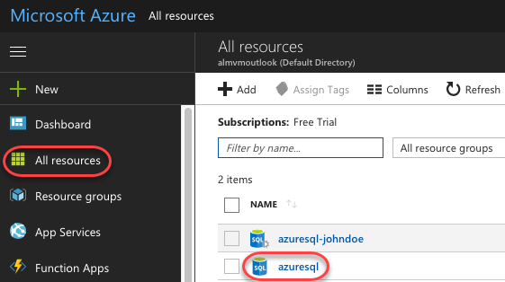

1. Before your app can access Azure SQL from outside Azure, you need to set a firewall rule to allow access. Click **Set server firewall**.

    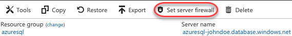

1. Click **Add client IP** to add the IP address you're currently connecting from and click **Save**. Now you can run the app locally and it will be able to connect to your Azure SQL Database.

    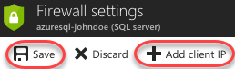

<a name="Ex1Task4"></a>
### Task 4: Connecting the ASP.NET Core website to Azure SQL ###

1. Close the **Firewall settings** blade to return to the database overview.

1. Click **Show database connection strings**.

    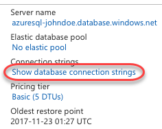

1. Click the **Copy** button to copy the connection string.

    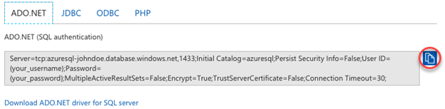

1. Return to **Visual Studio for Mac**.

1. Open **appsettings.json** from the project root.

1. Update the **MyDbConnection** property with the string you copied earlier. Note that you will need to replace **"{your_username}"** and **"{your_password}"** with the credentials you entered when creating the server (**sysadmin** and **P2ssw0rd** respectively in our example above).

    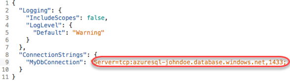

1. Select **Run | Start Debugging** or click the **Play icon** on the top left to build and run the app.

1. Your app will launch in a new browser tab. All of the data is stored in your Azure SQL Database, but there's nothing to show yet. Click **Create New** to add a new item.

    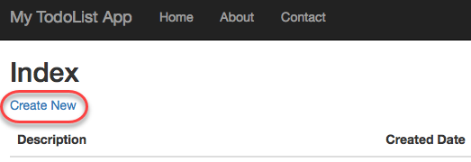

1. Fill out the form and click **Create**. Be sure to provide a valid date.

    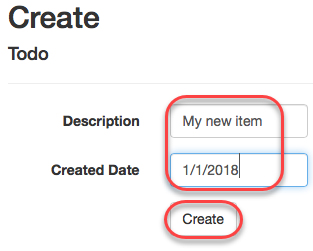

1. You can now see the TODO item stored in your Azure SQL Database.

    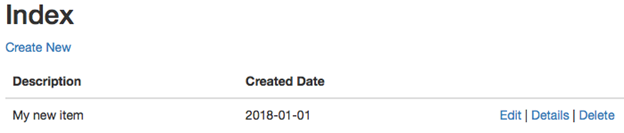

1. Deploying the app itself to Azure takes only a few more steps. Learn how to do this at the **[Publishing ASP.NET Core websites to Azure with Visual Studio for Mac lab](../Publish-Azure)**.

<a name="Summary"></a>
## Summary ##

In this lab, you've learned how to integrate an ASP.NET Core website with SQL Azure Database using Visual Studio for Mac.

