
# Publishing ASP.NET Core websites to Azure with Visual Studio for Mac #

## Overview ##

Visual Studio for Mac provides everything you need to create, develop, and publish modern websites to Azure.

In this lab you will create and publish an ASP.NET Core website to Azure.

## Objectives ##

- Creating an Azure account
- Creating an ASP.NET Core website
- Publishing the website to Azure

## Prerequisites ##

- [Visual Studio for Mac](https://www.visualstudio.com/vs/visual-studio-mac)

## Intended Audience ##

This lab is intended for developers who are familiar with C#, although deep experience is not required.

## Exercise 1: Publishing ASP.NET Core websites to Azure with Visual Studio for Mac ##

### Task 1: Creating an Azure account ###

1. Open a new instance of **Safari**.

1. If you already have a Microsoft Azure account, log in at [https://azure.com](https://azure.com/) and move ahead to the next task. If not, [create a free account](https://azure.microsoft.com/free?ref=VisualStudio).

1. Click **Start free**.

    

1. Sign in using a Microsoft account or create one.

    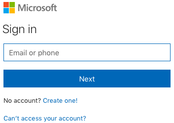

1. Fill out the personal details and click **Next**. Note that the email and phone number used here are preferred contact methods and do not need to be the same as your Microsoft account or personal number.

    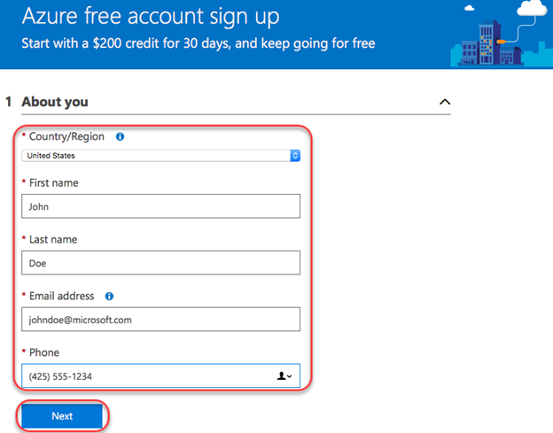

1. Enter a phone number you can use for verification and complete the verification process using your preferred method.

    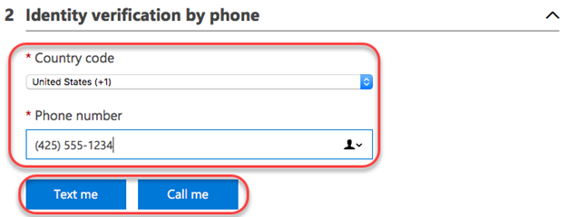

1. Enter your credit card info and click **Next**. You will not be charged without further authorization.

    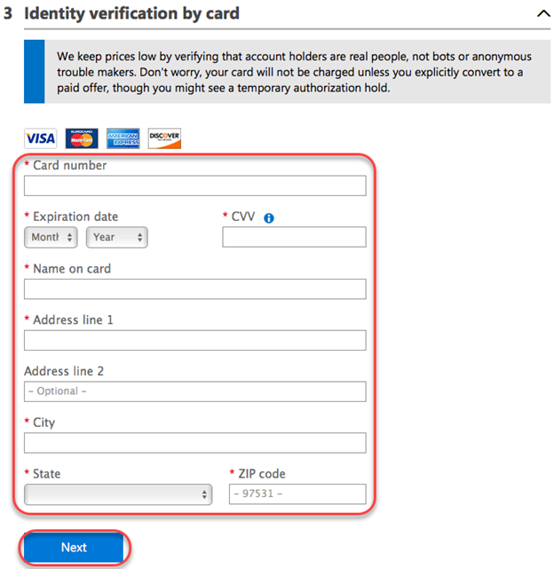

1. Check the box to agree to the terms and click **Sign up**.

    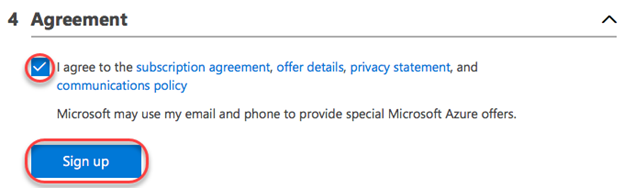

1. Select answers to the optional personalization questions and click **Submit**.

    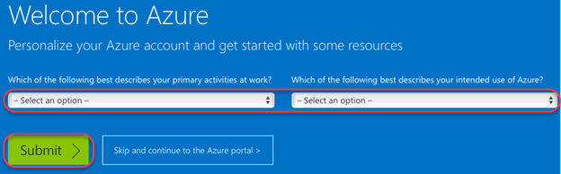

1. That's it! Your Azure account is now ready to go. Click **Continue to Azure portal** to get to your dashboard.

    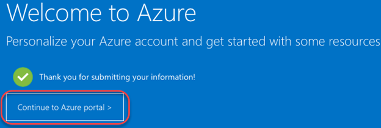

1. There isn't much here yet since the account is brand new. You'll create some resources in the coming steps.

    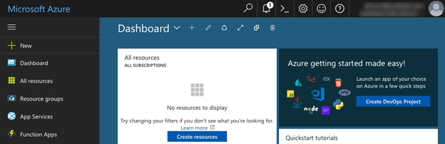

### Task 2: Creating an ASP.NET Core website ###

1. Open an instance of **Visual Studio for Mac**.

1. If asked to sign in with a Microsoft account, use the one associated with your Azure subscription. If not, or if you are already signed in with another account, select **Visual Studio Community | Account** and click on **Add...** to add the Microsoft account associated with your Azure subscription.

1. Select **File | New Solution**.

1. From the **.NET Core | App** category, select the **ASP.NET Core Web App** template and click **Next**.

    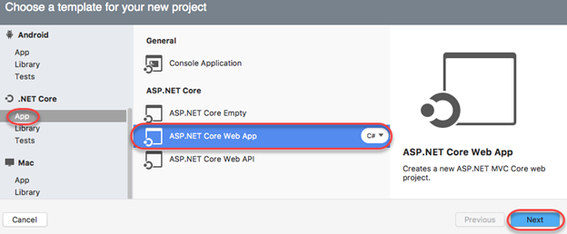

1. If prompted, select the **.NET Core 2.0** framework and click **Next**.

    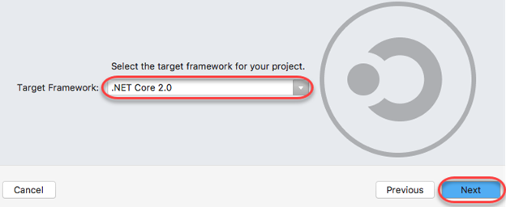

1. Enter a **Project Name** of **"AzureWebsite"** and click **Create**. This will create everything you need to get your ASP.NET Core website up and running. For more details on ASP.NET Core Web App development, check out the **[Getting started building ASP.NET Core applications in Visual Studio for Mac lab](../Getting-Started)**.

    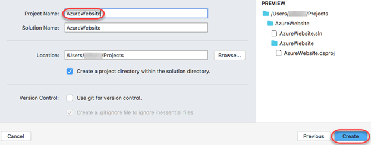

1. After the solution has been created, select **Run | Start Without Debugging** to build and run the website locally.

1. The site will load in a new browser tab. Close that tab when satisfied.

    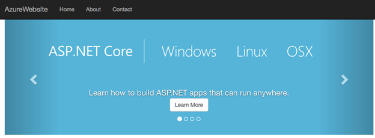

### Task 3: Publishing to Azure ###

1. In the **Solution** pad, right-click the project node and select **Publish | Publish to Azure**.

    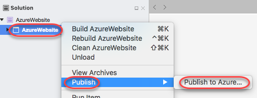

1. If you added multiple Microsoft accounts to Visual Studio for Mac, select the account associated with your Azure subscription in the drop-down menu. Click **New** to specify a new Azure app service.

    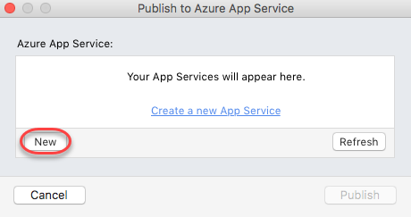

1. You will need a globally unique name for your app service. Start with **"AzureWebsite-"** and append a unique string, such as your name. In this case, we're using **"AzureWebsite-johndoe"**. Use the same name for the **Resource Group** and select a **Region** and **Pricing** tier. Click **Create**.

    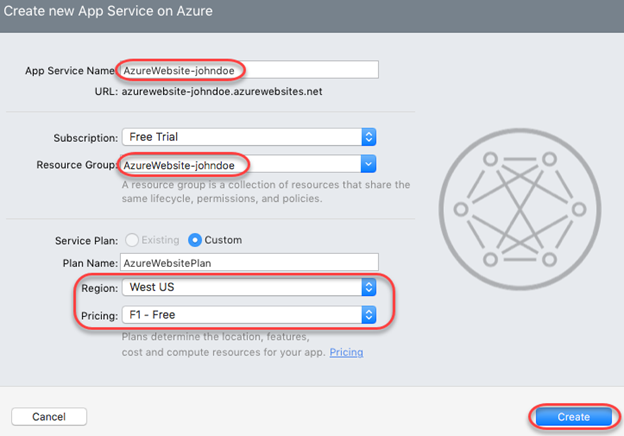

1. If given notice that the app service creation will take a while, click **OK**.

    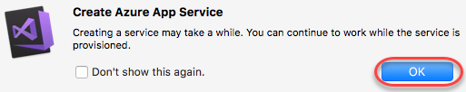

1. Once the service has been deployed, a new tab will open to the public site. Note that this URL starts with the name of your app service. You are now live!

    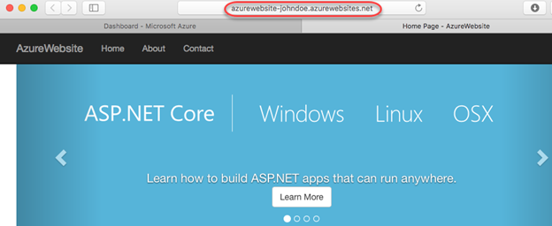

### Task 4: Managing your website in Azure ###

1. Return to the Azure dashboard tab from earlier. Search for **"azurewebsite"** and select the **App Service** result.

    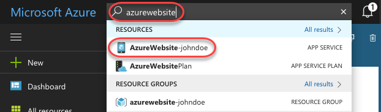

1. From here you can manage every aspect of your app in the cloud, such as scaling resources, changing permissions, and monitoring performance. You can also monitor and profile your app using Application Insights. Click the bar at the top of the overview.

    

1. Application Insights enables you to track multiple aspects of your applications. Click **OK** to add it to the resource group.

    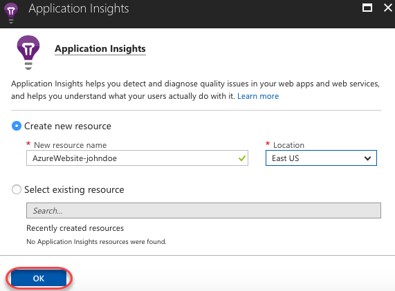

1. You can now return to your app to update Application Insights to use the account you just created. However, for the purposes of this lab you can click the **Automatically instrument** option. This will configure your existing deployment to start collecting usage data.

    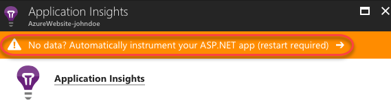

1. After the instrumentation has completed, return to your app to generate some traffic by clicking links.

1. Return to the Azure portal and click **View more in Application Insights**.

    

1. There should now be some basic traffic data streaming in. If it doesn't show up yet, try clicking **Refresh.** Note that this is just the surface of what Application Insights enables you to do. For more information, check out [the Application Insights website](https://azure.microsoft.com/services/application-insights/).

    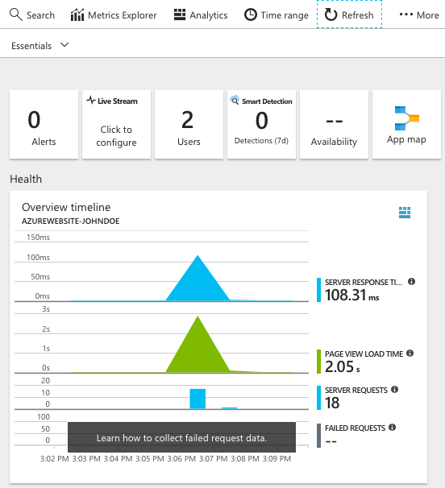

## Summary ##

In this lab, you've learned how to deploy an ASP.NET Core website to Azure using Visual Studio for Mac.

